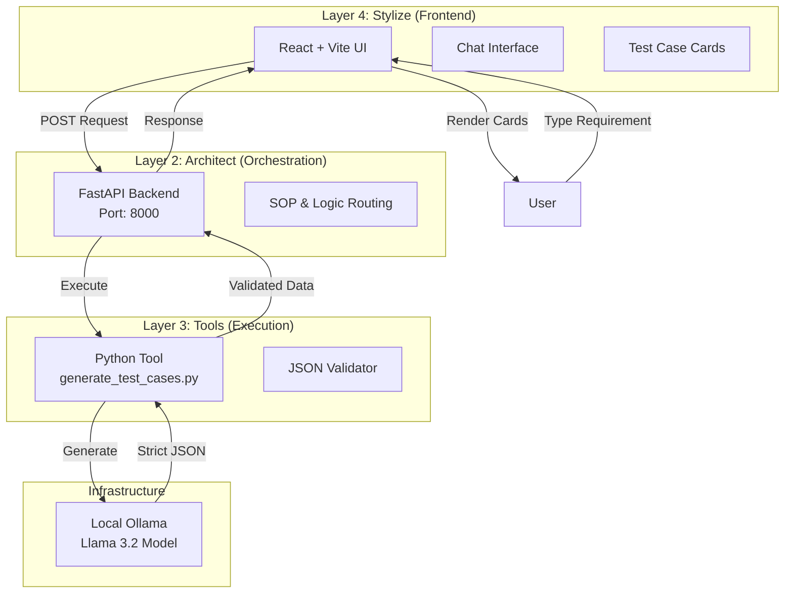

# 🧪 TestGen AI: Local LLM Test Case Generator

This project is a sophisticated, self-hosted AI tool that generates structured software test cases using a local **Ollama (Llama 3.2)** instance. It uses the **B.L.A.S.T.** (Blueprint, Link, Architect, Stylize, Trigger) architecture to ensure deterministic outputs from probabilistic LLMs.

---

## 🏗️ Architecture Diagram

This system follows a 3-Layer Agentic Architecture to separate concerns and ensure reliability.



---

## 🚀 Features

*   **🔒 Privacy First**: Runs entirely on your local machine. No data leaves your network.
*   **⚡ Zero Cost**: Uses local Llama 3.2 model (no API keys needed).
*   **🎨 Premium UI**: Glassmorphism design with React, TailwindCSS, and Lucide icons.
*   **🧠 Structured Output**: Automatically detects and formats test cases into clean, readable cards.
*   **📋 Copy-Ready**: One-click copy for manual testing or pasting into Jira/Notion.

---

## 🛠️ Prerequisites

1.  **[Ollama](https://ollama.com/)**: Installed and running.
2.  **Llama 3.2 Model**: Run `ollama pull llama3.2` in your terminal.
3.  **Node.js**: v18+ for the frontend.
4.  **Python**: v3.8+ for the backend.

---

## ⚡ Quick Start

### 1. Start the Backend (Orchestrator)
The backend handles the business logic and Tool execution.

```bash
cd backend
pip install -r requirements.txt
python server.py
```
*Runs on: `http://localhost:8000`*

### 2. Start the Frontend (UI)
The frontend provides the premium chat interface.

```bash
cd frontend
npm install
npm run dev
```
*Runs on: `http://localhost:5173`*

### 3. Usage
1.  Open **http://localhost:5173** in your browser.
2.  Type a feature description (e.g., *"Safe password reset flow with email verification"*).
3.  Watch as the AI generates and formats your test cases instantly.

---

## 📂 Project Structure

*   **/frontend**: React Application (Vite + TailwindCSS).
*   **/backend**: FastAPI server (B.L.A.S.T. Layer 2).
*   **/tools**: Standalone Python scripts for AI interaction (B.L.A.S.T. Layer 3).
*   **/architecture**: SOPs and architectural invariants.

---

*Verified locally on Windows 11 with Llama 3.2.*
